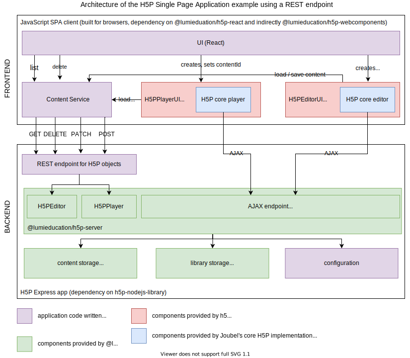

# H5P Single Page Application example using a REST API

This repository illustrates how to use the the packages of
[h5p-nodejs-library](https://github.com/lumieducation/h5p-nodejs-library) in a
Single Page Application with a REST backend in TypeScript.

Naturally the application is separated into a **client**, which uses React as a
framework. The **server** implements the `@lumieducation/h5p-server` using
Express. You are not bound to using React or Express in your own application, as
`@lumieducation/h5p-server` is framework agnostic.

Check out the architecture overview that describes which parts of the
application are provided by which package:

-   This repository contains all the components in **purple** boxes.
-   The **green** parts come from one of the server-side packages of
    `h5p-nodejs-library`. While `@lumieducation/h5p-server` is also a dev
    dependency of the client, this is only the case to use the TypeScript
    interface definitions exported by it. The dependency (which can be rather
    large) is only required at build time and not at runtime.
-   The **red** parts are React components that can be found in the package
    `@lumieducation/h5p-react`. The React components wrap around the web
    components from `@lumieducation/h5p-webcomponents`, which in turn wrap the
    actual core h5p player and editor JavaScript and simplify instantiation,
    loading, saving and event handling.
-   The **blue** parts is comprised of JavaScript and CSS files that make up the
    core H5P player and editor. They are part of the original PHP repositories
    and are downloaded from GitHub in the server with the script
    [`download-core.sh`](../../../packages/h5p-examples/download-core.sh). They
    must be served as static files by the server and are added to the page by
    the web components as needed.

## Trying it out

1. Clone the repository
2. Run `npm install` **in the root**. This will install all dependencies of the
   example packages and internally link the packages inside the monorepo with
   symlinks (lerna).
4. Run `npm build` **in the root**.
3. Run `npm build` for `h5p-rest-example-server` and `h5p-rest-example-client`.
4. Run `npm start` for the server. (Must be up and running before you start the
   client!)
5. Run `npm start` for the client.
6. A browser should open on http://localhost:3000. If there is an error, you
   have to reload the the page, as the server might not be fully initialized
   yet.

## Client

The client was bootstrapped with [Create React
App](https://github.com/facebook/create-react-app). For more information see
[client](./client.md)

## Support

This work obtained financial support for development from the German
BMBF-sponsored research project "lea.online -" (FKN: 41200147).

Read more about them at the following websites:

-   lea.online Blog (German) - blogs.uni-bremen.de/leaonline
-   University of Bremen - https://www.uni-bremen.de/en.html
-   BMBF - https://www.bmbf.de/en/index.html
